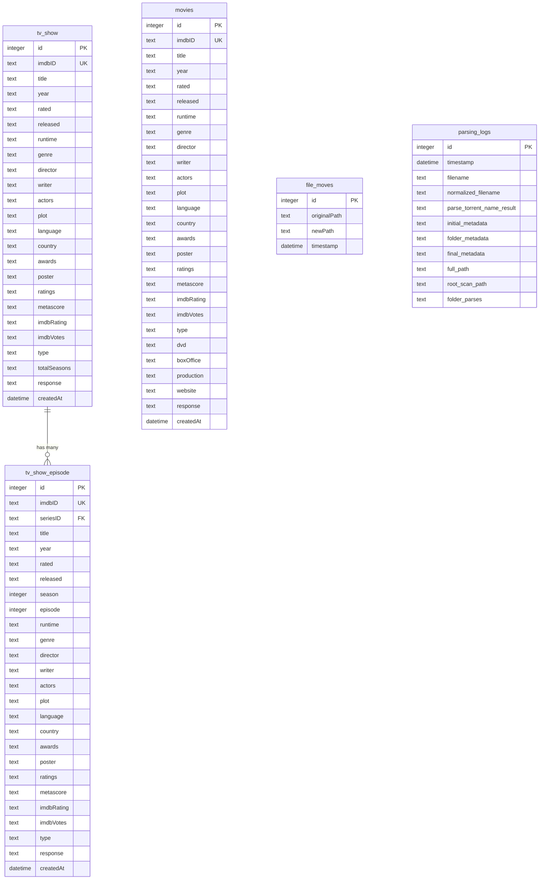
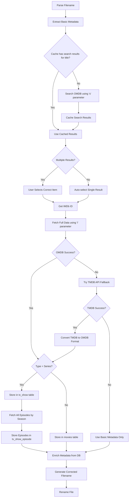

# Media Auto-Renamer Architecture and Implementation Plan

## Business Logic Overview

The Media Auto-Renamer program implements the following workflow:

1. **Parse filenames** to extract basic metadata (title, year, season, episode, type)
2. **Resolve IMDb ID** using OMDB API search with user disambiguation for ambiguous titles
3. **Fetch complete metadata** from OMDB API using IMDb ID
4. **Store full data** in SQLite database (tv_show, tv_show_episode, movies tables)
5. **Enrich future requests** from database cache
6. **Apply renaming** using accurate database metadata for proper capitalization

## Database Schema

### Entity Relationship Diagram



### tv_show Table
Based on OMDB series response structure:
- id (INTEGER PRIMARY KEY)
- imdbID (TEXT UNIQUE)
- title (TEXT)
- year (TEXT)
- rated (TEXT)
- released (TEXT)
- runtime (TEXT)
- genre (TEXT)
- director (TEXT)
- writer (TEXT)
- actors (TEXT)
- plot (TEXT)
- language (TEXT)
- country (TEXT)
- awards (TEXT)
- poster (TEXT)
- ratings (TEXT) - JSON string
- metascore (TEXT)
- imdbRating (TEXT)
- imdbVotes (TEXT)
- type (TEXT)
- totalSeasons (TEXT)
- response (TEXT)
- createdAt (DATETIME DEFAULT CURRENT_TIMESTAMP)

### tv_show_episode Table
Based on OMDB episode response structure:
- id (INTEGER PRIMARY KEY)
- imdbID (TEXT UNIQUE)
- seriesID (TEXT)
- title (TEXT)
- year (TEXT)
- rated (TEXT)
- released (TEXT)
- season (INTEGER)
- episode (INTEGER)
- runtime (TEXT)
- genre (TEXT)
- director (TEXT)
- writer (TEXT)
- actors (TEXT)
- plot (TEXT)
- language (TEXT)
- country (TEXT)
- awards (TEXT)
- poster (TEXT)
- ratings (TEXT) - JSON string
- metascore (TEXT)
- imdbRating (TEXT)
- imdbVotes (TEXT)
- type (TEXT)
- response (TEXT)
- createdAt (DATETIME DEFAULT CURRENT_TIMESTAMP)

### movies Table
Based on OMDB movie response structure:
- id (INTEGER PRIMARY KEY)
- imdbID (TEXT UNIQUE)
- title (TEXT)
- year (TEXT)
- rated (TEXT)
- released (TEXT)
- runtime (TEXT)
- genre (TEXT)
- director (TEXT)
- writer (TEXT)
- actors (TEXT)
- plot (TEXT)
- language (TEXT)
- country (TEXT)
- awards (TEXT)
- poster (TEXT)
- ratings (TEXT) - JSON string
- metascore (TEXT)
- imdbRating (TEXT)
- imdbVotes (TEXT)
- type (TEXT)
- dvd (TEXT)
- boxOffice (TEXT)
- production (TEXT)
- website (TEXT)
- response (TEXT)
- createdAt (DATETIME DEFAULT CURRENT_TIMESTAMP)

### file_moves Table (existing)
- id (INTEGER PRIMARY KEY)
- original_path (TEXT)
- new_path (TEXT)
- timestamp (DATETIME DEFAULT CURRENT_TIMESTAMP)

### parsing_logs Table (new)
- id (INTEGER PRIMARY KEY AUTOINCREMENT)
- timestamp (DATETIME DEFAULT CURRENT_TIMESTAMP)
- filename (TEXT)
- normalized_filename (TEXT)
- parse_torrent_name_result (TEXT) - JSON string
- initial_metadata (TEXT) - JSON string
- folder_metadata (TEXT) - JSON string
- final_metadata (TEXT) - JSON string
- full_path (TEXT)
- root_scan_path (TEXT)
- folder_parses (TEXT) - JSON array of folder parsing results

## Workflow Diagram



## API Integration Details

### OMDB API Usage
- **Search**: `http://www.omdbapi.com/?s={title}&apikey={key}` - Returns multiple results
- **By ID**: `http://www.omdbapi.com/?i={imdb_id}&apikey={key}` - Returns full data
- **Episodes**: `http://www.omdbapi.com/?i={series_id}&Season={season}&apikey={key}` - Returns season episodes

### TMDB API Integration (Fallback)
- **Search**: `https://api.themoviedb.org/3/search/tv?api_key={key}&query={title}` - Returns TV show results
- **Episode Details**: `https://api.themoviedb.org/3/tv/{series_id}/season/{season}/episode/{episode}?api_key={key}` - Returns episode data
- **Automatic Fallback**: When OMDB API fails, system automatically tries TMDB API
- **Data Conversion**: TMDB responses are converted to OMDB-compatible format for consistent processing
- **Rate Limits**: 4 requests/second, 50,000 requests/day (generous free tier)

### Session Caching
- In-memory Map<string, SearchResult[]> for search results
- Key: search term (title)
- Value: array of search results with Title, Year, imdbID, Type
- Cache persists for application session

### User Interaction for Ambiguous Titles
When multiple search results:
1. Display numbered list: "1. Title (Year) - Type"
2. Prompt user: "Multiple matches found. Enter number of correct title:"
3. Validate input and proceed with selected IMDb ID

## Implementation Phases

### Phase 1: Database Schema Redesign
- Create new tables with full OMDB fields
- Migrate existing simplified data if needed
- Add proper indexes for performance

### Phase 2: API Enhancement
- Implement search with 's' parameter
- Add session caching mechanism
- Update data fetching to store complete OMDB responses
- Implement episode batch fetching and storage

### Phase 3: Metadata Enrichment Update
- Modify enrichMetadata to check database first
- Implement IMDb ID resolution workflow
- Update episode lookup to use series_imdb_id

### Phase 4: Organizer Updates
- Use database titles for accurate casing
- Ensure all metadata comes from stored data
- Maintain backward compatibility

### Phase 5: Testing and Validation
- Test complete flow from filename to rename
- Validate API caching reduces calls
- Ensure proper error handling for API failures

## Key Technical Decisions

1. **Full Data Storage**: Store complete OMDB responses to eliminate future API calls
2. **IMDb ID as Primary Key**: Use IMDb ID for reliable unique identification
3. **Session Caching**: In-memory cache to avoid repeated searches within a session
4. **User Disambiguation**: Interactive selection for ambiguous titles
5. **Episode Prefetching**: Fetch entire seasons when encountering first episode
6. **Database-First Architecture**: All enrichment from local database after initial fetch
7. **Dual API Support**: TMDB API as fallback when OMDB fails for enhanced reliability
8. **Parsing Debug Logging**: Comprehensive logging of filename parsing steps for troubleshooting
9. **File Verification System**: Automated detection and correction of misplaced media files

## Error Handling

- **API Failures**: OMDB failures automatically fall back to TMDB API, then to web scraping
- **Invalid user selections**: Prompt re-entry with validation
- **Database connection issues**: Logged and handled gracefully with connection recovery
- **Missing data fields**: Use null/empty values with appropriate defaults
- **Network timeouts**: Configurable retry logic with exponential backoff
- **File system errors**: Comprehensive error logging with recovery suggestions

## File System Compatibility

### Filename Sanitization

To prevent file system errors when creating folders and files from movie/TV show titles, all generated names are sanitized to remove or replace invalid characters.

#### Invalid Characters by Platform

**Windows Forbidden Characters:**
- `<` → `＜` (full-width less-than)
- `>` → `＞` (full-width greater-than)
- `:` → `：` (full-width colon)
- `"` → `"` (full-width double quote)
- `|` → `｜` (full-width pipe)
- `?` → `？` (full-width question mark)
- `*` → `＊` (full-width asterisk)
- `\` → `＼` (full-width backslash)

**Linux/macOS Forbidden Characters:**
- `/` → `／` (full-width forward slash)

**Universal Issues:**
- Control characters (0x00-0x1F, 0x7F-0x9F) → removed
- Trailing dots/spaces → removed

#### Sanitization Process

1. Replace Windows forbidden characters with full-width equivalents
2. Replace Unix forbidden characters with full-width equivalents
3. Remove all control characters
4. Remove trailing dots and spaces
5. Ensure result is not empty (fallback to "Untitled")

#### Alternative Simple Approach

For systems preferring character removal over replacement:

```typescript
function sanitizeFilenameSimple(filename: string): string {
  const charsToRemove = '<>:"|?*\\/';
  let sanitized = filename;

  for (const char of charsToRemove) {
    sanitized = sanitized.replace(new RegExp(`\\${char}`, 'g'), '');
  }

  sanitized = sanitized.replace(/[\x00-\x1F\x7F-\x9F]/g, '');
  sanitized = sanitized.replace(/[.\s]+$/, '');

  return sanitized.trim() || 'Untitled';
}
```

#### Implementation Location

Filename sanitization is applied in `src/core-data/parser.ts` within the `generateNewName()` function to ensure all generated folder and file names are file system safe.

## Performance Considerations

- **Database indexes**: Optimized indexes on imdbID, Title, seriesID for fast lookups
- **Session caching**: In-memory cache reduces API calls within application sessions
- **Batch episode storage**: Efficient bulk operations for TV episode data
- **Lazy loading**: Full data loaded only when needed, reducing memory usage
- **Dual API optimization**: TMDB fallback ensures high success rate for metadata retrieval
- **Parsing debug logging**: Optional logging with minimal performance impact
- **File verification**: Efficient scanning algorithms for large media libraries